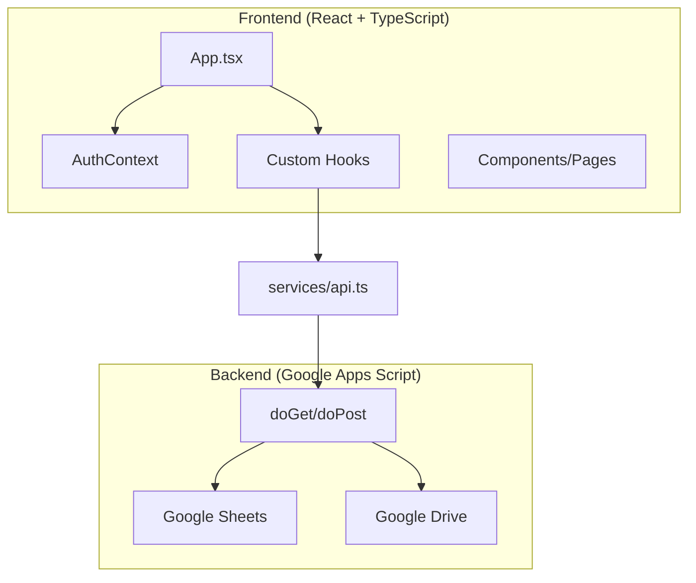
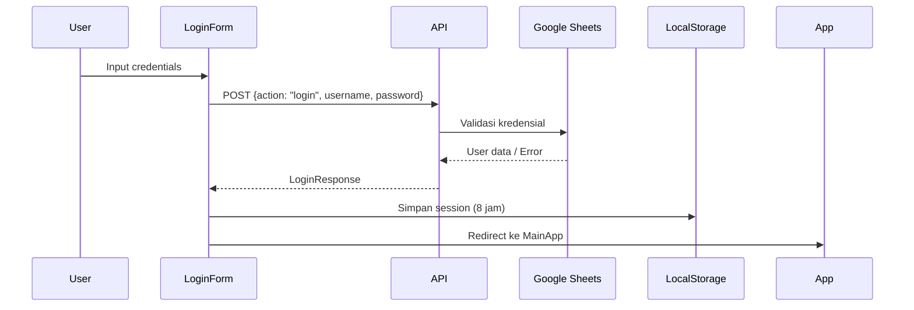

# 📘 Panduan Logika Aplikasi POS RESTO

Dokumentasi ini menjelaskan arsitektur dan logika bisnis dari aplikasi POS Resto yang dapat diterapkan ke project lain.

---

## 📐 Arsitektur Aplikasi



---

## 🗂️ Struktur Data (Types)

### Product (Produk)

```typescript
interface Product {
  id: string; // ID unik produk
  name: string; // Nama produk
  price: number; // Harga satuan
  image: string; // URL gambar
  category: string; // Kategori produk
  stock: number; // Jumlah stok
  stockType: "STOK_FISIK" | "NON_STOK" | "JASA"; // Tipe stok
  available: boolean; // Status ketersediaan
  priceType?: "FIXED" | "FLEXIBLE"; // Harga tetap/fleksibel
  modifierGroupIds?: string[]; // ID grup modifier
}
```

**Penjelasan `stockType`:**

- `STOK_FISIK`: Produk dengan stok terbatas, berkurang saat transaksi
- `NON_STOK`: Produk tanpa pelacakan stok (misal: makanan)
- `JASA`: Layanan tanpa stok fisik

---

### CartItem (Item Keranjang)

```typescript
interface CartItem extends Product {
  qty: number; // Kuantitas di keranjang
  note?: string; // Catatan khusus
  selectedModifiers?: SelectedModifier[]; // Modifier terpilih
  modifierTotal?: number; // Total harga modifier
}
```

---

### TransactionRecord (Rekaman Transaksi)

```typescript
interface TransactionRecord {
  id: string;
  timestamp: string;
  subtotal: number;
  tax: number;
  total: number;
  cashReceived: number;
  change: number;
  orderType: string; // "Dine In" | "Take Away"
  tableNumber: string;
  cashier: string;
  paymentMethod?: string;
  items?: any[];
  donation?: number;
}
```

---

### User & Roles

```typescript
interface User {
  id: string;
  username: string;
  name: string;
  role: "ADMIN" | "MANAGER" | "KASIR";
  email?: string;
  phone?: string;
  isActive: boolean;
  createdAt: string;
  lastLogin?: string;
}
```

---

## 🔐 Sistem Autentikasi

### Alur Login



### Implementasi Session

```typescript
const SESSION_KEY = "pos_user_session";

// Simpan session dengan expiry 8 jam
const session = {
  user: userData,
  expiresAt: new Date(Date.now() + 8 * 60 * 60 * 1000).toISOString(),
};
localStorage.setItem(SESSION_KEY, JSON.stringify(session));

// Check session validity
const sessionData = JSON.parse(localStorage.getItem(SESSION_KEY));
if (new Date(sessionData.expiresAt) > new Date()) {
  // Session masih valid
}
```

### Role-Based Access Control (RBAC)

```typescript
const accessMap = {
  dashboard: ["ADMIN", "MANAGER", "KASIR"],
  pos: ["ADMIN", "MANAGER", "KASIR"],
  reports: ["ADMIN", "MANAGER"],
  finance: ["ADMIN", "MANAGER"],
  items: ["ADMIN", "MANAGER"],
  users: ["ADMIN"],
  settings: ["ADMIN"],
};

// Check akses
const checkAccess = (view) => accessMap[view]?.includes(user?.role);
```

---

## 🛒 Logika Keranjang (Cart)

### Hook useCart

File: `hooks/useCart.ts`

**Fitur Utama:**

1. **Unique Key System**: Setiap item diidentifikasi berdasarkan `id-price`
2. **Auto Packaging**: Otomatis tambah biaya bungkus untuk Take Away

```typescript
// Unique key untuk item keranjang
const getUniqueKey = (item, price) => `${item.id}-${price}`;

// Tambah ke keranjang
const addToCart = (product, customPrice?) => {
  const priceToUse = customPrice ?? product.price;
  const targetKey = getUniqueKey(product, priceToUse);

  // Cek apakah sudah ada di keranjang
  const existingIndex = cart.findIndex(
    (item) => getUniqueKey(item) === targetKey
  );

  if (existingIndex > -1) {
    // Tambah qty
    cart[existingIndex].qty += 1;
  } else {
    // Item baru
    cart.push({ ...product, price: priceToUse, qty: 1 });
  }
};
```

### Auto-Bungkus Logic

```typescript
useEffect(() => {
  if (orderType === "Take Away") {
    const hasBungkus = cart.some((item) =>
      item.name.toLowerCase().includes("bungkus")
    );

    if (!hasBungkus) {
      // Cari produk bungkus dari daftar produk
      const bungkusProduct = products.find((p) =>
        p.name.toLowerCase().includes("bungkus")
      );

      if (bungkusProduct) {
        addToCart(bungkusProduct);
      } else {
        // Fallback default
        addToCart({
          id: "V-BUNGKUS",
          name: "Biaya Bungkus (TA)",
          price: 2000,
          category: "Service",
          stockType: "NON_STOK",
        });
      }
    }
  } else if (orderType === "Dine In") {
    // Hapus biaya bungkus saat ganti ke Dine In
    setCart((prev) =>
      prev.filter((item) => !item.name.toLowerCase().includes("bungkus"))
    );
  }
}, [orderType]);
```

---

## 💰 Logika Pembayaran (Checkout)

### Metode Pembayaran

```typescript
enum PaymentMethod {
  TUNAI = "Tunai",
  PIUTANG = "Piutang",
  QRIS = "QRIS",
}
```

### Perhitungan Transaksi

```typescript
// Subtotal
const subtotal = cart.reduce((acc, item) => acc + item.price * item.qty, 0);

// Pajak (10%) - kecuali donasi
const taxableAmount = cart.reduce((acc, item) => {
  if (item.category.toLowerCase() === "donasi") return acc;
  return acc + item.price * item.qty;
}, 0);
const tax = Math.round(taxableAmount * 0.1);

// Total
const total = subtotal + tax;

// Kembalian
const change = cashReceived - total;
```

### Alokasi Dana per Item

```typescript
const itemsWithAllocation = cart.map((item) => {
  let allocation = "Umum";

  if (item.category.toLowerCase() === "donasi") {
    allocation = "Donasi";
  } else {
    allocation =
      paymentMethod === PaymentMethod.TUNAI
        ? "Saldo Tunai"
        : paymentMethod === PaymentMethod.QRIS
        ? "Saldo QRIS"
        : `Piutang: ${debtorName}`;
  }

  return { ...item, allocation };
});
```

### Fitur Donasi Kembalian

```typescript
const handleDonateChange = async () => {
  if (change <= 0) return;

  const donationItem = products.find(
    (p) => p.category.toLowerCase() === "donasi"
  );

  if (donationItem) {
    // Dispatch custom event untuk tambah donasi dengan harga fleksibel
    window.dispatchEvent(
      new CustomEvent("add-to-cart-flexible", {
        detail: { product: donationItem, price: change },
      })
    );
  }
};
```

---

## 📦 Manajemen Stok

### Tipe Aksi Stok

```typescript
type StockActionType = "STOCK_IN" | "STOCK_OUT" | "ADJUSTMENT";

// API Call
const adjustStock = async (
  productId: string,
  quantity: number,
  actionType: StockActionType,
  notes: string
) => {
  return await postToScript({
    action: "adjustStock",
    productId,
    quantity,
    actionType,
    notes,
  });
};
```

### Logika Update Stok

- **STOCK_IN**: Menambah stok (pembelian/restock)
- **STOCK_OUT**: Mengurangi stok (penggunaan manual)
- **ADJUSTMENT**: Penyesuaian stok (koreksi/stockopname)

---

## 📊 API Service Layer

### Struktur API dengan Google Apps Script

File: `services/api.ts`

```typescript
const GOOGLE_SCRIPT_URL = "https://script.google.com/...";

// GET Request dengan timeout
const fetchWithTimeout = async (url, options = {}, timeout = 20000) => {
  const controller = new AbortController();
  const id = setTimeout(() => controller.abort(), timeout);

  try {
    const response = await fetch(url, {
      ...options,
      signal: controller.signal,
    });
    clearTimeout(id);
    return response;
  } catch (error) {
    clearTimeout(id);
    throw error;
  }
};

// POST Request (tanpa Content-Type untuk hindari preflight)
const postToScript = async (payload) => {
  const response = await fetch(GOOGLE_SCRIPT_URL, {
    method: "POST",
    mode: "cors",
    redirect: "follow",
    body: JSON.stringify(payload), // TANPA Content-Type header!
  });
  return await response.json();
};
```

### Daftar API Endpoints

| Action            | Method | Deskripsi               |
| ----------------- | ------ | ----------------------- |
| `getProducts`     | GET    | Ambil semua produk      |
| `getCategories`   | GET    | Ambil kategori          |
| `getTransactions` | GET    | Ambil riwayat transaksi |
| `getModifiers`    | GET    | Ambil modifier groups   |
| `addOrder`        | POST   | Simpan transaksi baru   |
| `addProduct`      | POST   | Tambah produk baru      |
| `updateProduct`   | POST   | Update produk           |
| `deleteProduct`   | POST   | Hapus produk            |
| `adjustStock`     | POST   | Sesuaikan stok          |
| `uploadImage`     | POST   | Upload gambar ke Drive  |
| `login`           | POST   | Autentikasi user        |

---

## 🔄 Caching Strategy

### Local Storage Caching

File: `hooks/useAppData.ts`

```typescript
const CACHE_KEYS = {
  PRODUCTS: "pos_cache_products",
  CATEGORIES: "pos_cache_categories",
  TRANSACTIONS: "pos_cache_transactions",
  MODIFIERS: "pos_cache_modifiers",
  TIMESTAMP: "pos_cache_timestamp",
};

// Load dari cache dulu (instant)
useEffect(() => {
  const cachedProducts = localStorage.getItem(CACHE_KEYS.PRODUCTS);
  if (cachedProducts) {
    setProducts(JSON.parse(cachedProducts));
    setIsLoading(false); // UI segera responsif
  }
}, []);

// Fetch fresh data di background
const fetchData = async (isSilent = false) => {
  if (!isSilent) setIsLoading(true);

  const [prodData, catData, transData, modData] = await Promise.all([
    getProducts(),
    getCategories(),
    getTransactions(),
    getModifiers(),
  ]);

  // Update state dan cache
  setProducts(prodData);
  localStorage.setItem(CACHE_KEYS.PRODUCTS, JSON.stringify(prodData));
};
```

---

## 🖨️ Logika Print Receipt

```typescript
const printReceipt = (orderId, items, subtotal, tax, total, ...) => {
  const printArea = document.getElementById('print-area');

  // Generate HTML receipt
  printArea.innerHTML = `
    <div style="text-align: center;">
      <h2>FOODCOURT POS</h2>
      <p>Nota Transaksi</p>
    </div>
    <!-- Item list -->
    <table>
      ${items.map(item => `
        <tr><td>${item.name}</td></tr>
        <tr><td>${item.price} x ${item.qty}</td>
            <td>${item.price * item.qty}</td></tr>
      `).join('')}
    </table>
    <!-- Totals -->
    <div>Subtotal: ${subtotal}</div>
    <div>Pajak: ${tax}</div>
    <div>TOTAL: ${total}</div>
  `;

  window.print();
};
```

---

## 🎯 Pattern yang Bisa Dipakai Ulang

### 1. Authentication Pattern

- Context Provider untuk state global
- Session dengan expiry di localStorage
- RBAC (Role-Based Access Control)

### 2. Data Fetching Pattern

- Cache-first strategy
- Parallel fetching dengan Promise.all
- Silent background refresh

### 3. Cart Pattern

- Unique key berdasarkan id + price
- Custom events untuk komunikasi antar komponen
- Reactive effects (auto-packaging)

### 4. Form Pattern

- Controlled inputs
- Real-time validation
- Toast notifications

### 5. API Pattern

- Centralized API service
- Timeout handling
- Fallback ke mock data

---

## 📁 Struktur File yang Direkomendasikan

```
src/
├── components/          # Komponen UI
│   ├── ui/             # Reusable UI components
│   ├── ItemsPage.tsx   # Manajemen produk
│   ├── UsersPage.tsx   # Manajemen user
│   ├── OrderPanel.tsx  # Panel checkout
│   └── ReportsPage.tsx # Laporan transaksi
├── hooks/              # Custom React hooks
│   ├── useAppData.ts   # Data fetching & caching
│   └── useCart.ts      # Cart logic
├── modules/            # Feature modules
│   └── user/           # Auth module
│       ├── AuthContext.tsx
│       ├── LoginForm.tsx
│       └── types.ts
├── services/           # API layer
│   └── api.ts
├── styles/             # Design system
│   └── design-system.ts
├── types.ts            # Global TypeScript types
├── constants.ts        # App constants
└── App.tsx             # Root component
```

---

## ⚡ Quick Start untuk Project Baru

1. **Copy struktur types.ts** - Sesuaikan dengan kebutuhan bisnis
2. **Setup API service** - Sesuaikan endpoint
3. **Implementasi AuthContext** - Ubah logic autentikasi sesuai backend
4. **Copy hooks** - useAppData dan useCart bisa langsung dipakai
5. **Build komponen** - Gunakan pattern yang sama

---

> **💡 Tip**: Dokumentasi ini bisa dijadikan referensi saat membangun aplikasi POS, inventory, atau e-commerce dengan React + TypeScript.
