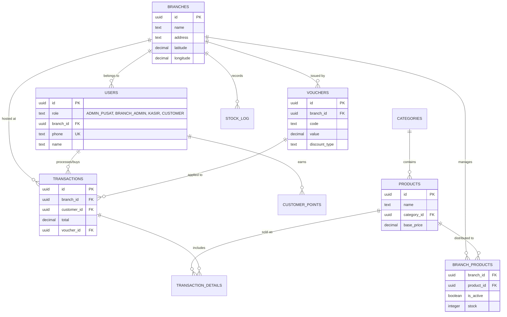

# POS_RESTO Backend Data Relations (Hybrid Monolith)

Dokumentasi lengkap tentang struktur data dan hubungan antar tabel untuk aplikasi POS_RESTO yang mendukung Multi-Cabang, Manajemen Produk berbasis Role, dan Loyalty System.

---

## Entity Relationship Diagram (ERD)



---

## Penjelasan Relasi Data Baru

### 1. Multi-Branch Isolation

Data transaksi (`transactions`), stok (`stock_log`), dan voucher (`vouchers`) sekarang terikat pada `branch_id`. Ini memungkinkan setiap cabang memiliki laporan dan promo yang terpisah.

### 2. Role-Based Product Management

- **PRODUCTS (Global)**: Merupakan katalog induk yang hanya bisa dibuat/diedit oleh **Admin Pusat**.
- **BRANCH_PRODUCTS (Local)**: Merupakan tabel operasional cabang. **Branch Admin** hanya mengelola ketersediaan (`is_active`) dan jumlah stok di cabangnya masing-masing.

### 3. Customer Loyalty

- Setiap transaksi oleh `customer_id` akan memicu trigger di database untuk menambahkan poin ke `customer_points` secara otomatis.
- Voucher bersifat spesifik per cabang (`vouchers.branch_id`) untuk mendukung promosi lokal.

---

## Struktur Tabel (Update)

### branch_products

| Column     | Type    | Constraints        | Description                      |
| ---------- | ------- | ------------------ | -------------------------------- |
| branch_id  | uuid    | FK -> branches(id) | ID Cabang                        |
| product_id | uuid    | FK -> products(id) | ID Produk dari katalog pusat     |
| is_active  | boolean | DEFAULT true       | Status ketersediaan di cabang    |
| stock      | integer | DEFAULT 0          | Stok spesifik di cabang tersebut |

### users (Update)

| Column    | Type | Constraints                      | Description                  |
| --------- | ---- | -------------------------------- | ---------------------------- |
| role      | text | ADMIN_PUSAT, BRANCH_ADMIN, KASIR | Hak akses user               |
| branch_id | uuid | FK -> branches(id)               | Cabang tempat staff bertugas |

---

---

## Supabase SQL Migration Script

```sql
-- ===============================================
-- POS_RESTO Database Schema for Supabase
-- ===============================================

-- Enable UUID extension
CREATE EXTENSION IF NOT EXISTS "uuid-ossp";

-- 1. Users Table
CREATE TABLE users (
    id UUID DEFAULT uuid_generate_v4() PRIMARY KEY,
    username TEXT UNIQUE NOT NULL,
    password TEXT NOT NULL,
    name TEXT NOT NULL,
    role TEXT NOT NULL CHECK (role IN ('ADMIN', 'KASIR')),
    email TEXT,
    phone TEXT,
    avatar TEXT,
    created_at TIMESTAMPTZ DEFAULT NOW(),
    last_login TIMESTAMPTZ,
    is_active BOOLEAN DEFAULT TRUE
);

-- 2. Categories Table
CREATE TABLE categories (
    id UUID DEFAULT uuid_generate_v4() PRIMARY KEY,
    name TEXT UNIQUE NOT NULL,
    icon TEXT
);

-- 3. Products Table
CREATE TABLE products (
    id UUID DEFAULT uuid_generate_v4() PRIMARY KEY,
    name TEXT NOT NULL,
    category_id UUID REFERENCES categories(id) ON DELETE SET NULL,
    price DECIMAL(12,2) NOT NULL DEFAULT 0,
    stock INTEGER DEFAULT 0,
    stock_type TEXT NOT NULL CHECK (stock_type IN ('STOK_FISIK', 'NON_STOK', 'JASA')),
    available BOOLEAN DEFAULT TRUE,
    image TEXT,
    price_type TEXT DEFAULT 'FIXED' CHECK (price_type IN ('FIXED', 'FLEXIBLE')),
    created_at TIMESTAMPTZ DEFAULT NOW(),
    updated_at TIMESTAMPTZ DEFAULT NOW()
);

-- 4. Modifier Groups Table
CREATE TABLE modifier_groups (
    id UUID DEFAULT uuid_generate_v4() PRIMARY KEY,
    name TEXT NOT NULL,
    type TEXT DEFAULT 'MULTIPLE' CHECK (type IN ('SINGLE', 'MULTIPLE')),
    required BOOLEAN DEFAULT FALSE,
    min_select INTEGER DEFAULT 0,
    max_select INTEGER DEFAULT 10
);

-- 5. Modifier Items Table
CREATE TABLE modifier_items (
    id UUID DEFAULT uuid_generate_v4() PRIMARY KEY,
    group_id UUID REFERENCES modifier_groups(id) ON DELETE CASCADE,
    name TEXT NOT NULL,
    price_adjust DECIMAL(12,2) DEFAULT 0,
    available BOOLEAN DEFAULT TRUE
);

-- 6. Product-ModifierGroups Junction Table
CREATE TABLE product_modifier_groups (
    product_id UUID REFERENCES products(id) ON DELETE CASCADE,
    modifier_group_id UUID REFERENCES modifier_groups(id) ON DELETE CASCADE,
    PRIMARY KEY (product_id, modifier_group_id)
);

-- 7. Transactions Table
CREATE TABLE transactions (
    id UUID DEFAULT uuid_generate_v4() PRIMARY KEY,
    created_at TIMESTAMPTZ DEFAULT NOW(),
    subtotal DECIMAL(12,2) NOT NULL,
    tax DECIMAL(12,2) DEFAULT 0,
    total DECIMAL(12,2) NOT NULL,
    cash_received DECIMAL(12,2),
    change DECIMAL(12,2),
    order_type TEXT,
    table_number TEXT,
    cashier_id UUID REFERENCES users(id) ON DELETE SET NULL,
    payment_method TEXT CHECK (payment_method IN ('Tunai', 'QRIS', 'Piutang'))
);

-- 8. Transaction Details Table
CREATE TABLE transaction_details (
    id UUID DEFAULT uuid_generate_v4() PRIMARY KEY,
    transaction_id UUID REFERENCES transactions(id) ON DELETE CASCADE,
    product_id UUID REFERENCES products(id) ON DELETE SET NULL,
    product_name TEXT NOT NULL,
    qty INTEGER NOT NULL,
    price DECIMAL(12,2) NOT NULL,
    note TEXT,
    total_price DECIMAL(12,2) GENERATED ALWAYS AS (qty * price) STORED,
    allocation TEXT DEFAULT 'Umum',
    selected_modifiers JSONB,
    modifier_total DECIMAL(12,2) DEFAULT 0
);

-- 9. Stock Log Table
CREATE TABLE stock_log (
    id UUID DEFAULT uuid_generate_v4() PRIMARY KEY,
    created_at TIMESTAMPTZ DEFAULT NOW(),
    product_id UUID REFERENCES products(id) ON DELETE SET NULL,
    product_name TEXT NOT NULL,
    action_type TEXT NOT NULL CHECK (action_type IN ('STOCK_IN', 'STOCK_OUT', 'SALE_OUT', 'ADJUSTMENT', 'UPLOAD_PRODUCT', 'UPDATE_STOCK')),
    stock_value INTEGER NOT NULL,
    notes TEXT
);

-- ===============================================
-- Indexes for Performance
-- ===============================================

CREATE INDEX idx_products_category ON products(category_id);
CREATE INDEX idx_modifier_items_group ON modifier_items(group_id);
CREATE INDEX idx_transactions_cashier ON transactions(cashier_id);
CREATE INDEX idx_transactions_created ON transactions(created_at DESC);
CREATE INDEX idx_transaction_details_transaction ON transaction_details(transaction_id);
CREATE INDEX idx_stock_log_product ON stock_log(product_id);
CREATE INDEX idx_stock_log_created ON stock_log(created_at DESC);

-- ===============================================
-- Row Level Security (RLS) Policies
-- ===============================================

ALTER TABLE users ENABLE ROW LEVEL SECURITY;
ALTER TABLE categories ENABLE ROW LEVEL SECURITY;
ALTER TABLE products ENABLE ROW LEVEL SECURITY;
ALTER TABLE modifier_groups ENABLE ROW LEVEL SECURITY;
ALTER TABLE modifier_items ENABLE ROW LEVEL SECURITY;
ALTER TABLE product_modifier_groups ENABLE ROW LEVEL SECURITY;
ALTER TABLE transactions ENABLE ROW LEVEL SECURITY;
ALTER TABLE transaction_details ENABLE ROW LEVEL SECURITY;
ALTER TABLE stock_log ENABLE ROW LEVEL SECURITY;

-- Basic policy: Allow authenticated users to read all
CREATE POLICY "Allow read for authenticated users" ON users FOR SELECT TO authenticated USING (true);
CREATE POLICY "Allow read for authenticated users" ON categories FOR SELECT TO authenticated USING (true);
CREATE POLICY "Allow read for authenticated users" ON products FOR SELECT TO authenticated USING (true);
CREATE POLICY "Allow read for authenticated users" ON modifier_groups FOR SELECT TO authenticated USING (true);
CREATE POLICY "Allow read for authenticated users" ON modifier_items FOR SELECT TO authenticated USING (true);
CREATE POLICY "Allow read for authenticated users" ON product_modifier_groups FOR SELECT TO authenticated USING (true);
CREATE POLICY "Allow read for authenticated users" ON transactions FOR SELECT TO authenticated USING (true);
CREATE POLICY "Allow read for authenticated users" ON transaction_details FOR SELECT TO authenticated USING (true);
CREATE POLICY "Allow read for authenticated users" ON stock_log FOR SELECT TO authenticated USING (true);

-- ===============================================
-- Default Data
-- ===============================================

-- Default admin user (password should be hashed in production)
INSERT INTO users (username, password, name, role, is_active) VALUES
('admin', 'admin123', 'Administrator', 'ADMIN', TRUE),
('kasir', 'kasir123', 'Kasir Utama', 'KASIR', TRUE);

-- Default categories
INSERT INTO categories (name, icon) VALUES
('Food', '🍔'),
('Drinks', '🥤'),
('Snack', '🍿');

-- ===============================================
-- Trigger for auto-update stock on sale
-- ===============================================

CREATE OR REPLACE FUNCTION update_product_stock()
RETURNS TRIGGER AS $$
BEGIN
    -- Only update for physical stock products
    UPDATE products
    SET stock = stock - NEW.qty,
        updated_at = NOW()
    WHERE id = NEW.product_id
    AND stock_type = 'STOK_FISIK';

    -- Log the stock change
    INSERT INTO stock_log (product_id, product_name, action_type, stock_value, notes)
    SELECT NEW.product_id, NEW.product_name, 'SALE_OUT', -NEW.qty, 'Penjualan via POS'
    WHERE EXISTS (SELECT 1 FROM products WHERE id = NEW.product_id AND stock_type = 'STOK_FISIK');

    RETURN NEW;
END;
$$ LANGUAGE plpgsql;

CREATE TRIGGER trigger_update_stock_on_sale
AFTER INSERT ON transaction_details
FOR EACH ROW
EXECUTE FUNCTION update_product_stock();
```

---

## Verification Plan

### Cara Verifikasi di Supabase:

1. **Buka Supabase Dashboard** → Project Anda → SQL Editor
2. **Jalankan SQL migration script** di atas
3. **Cek Table Editor** untuk memverifikasi semua tabel sudah dibuat
4. **Test relasi** dengan query:

   ```sql
   -- Test join products dengan categories
   SELECT p.name, c.name as category FROM products p
   JOIN categories c ON p.category_id = c.id;

   -- Test join transaction dengan details
   SELECT t.id, td.product_name, td.qty FROM transactions t
   JOIN transaction_details td ON td.transaction_id = t.id;
   ```

---

## Catatan Penting untuk Migrasi

> [!IMPORTANT] > **Password Hashing:** Di production, gunakan `crypt()` atau `pgcrypto` untuk hash password, bukan plain text.

> [!TIP] > **Supabase Auth:** Pertimbangkan untuk menggunakan Supabase Auth bawaan daripada tabel users custom untuk keamanan lebih baik.

> [!NOTE]
> Struktur `selected_modifiers` di `transaction_details` menggunakan JSONB untuk fleksibilitas menyimpan array modifier yang dipilih.
