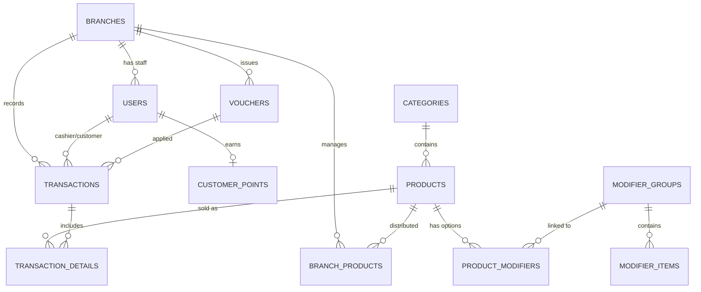

# POS RESTO - Database Schema & Relations

> **Update Terakhir**: 1 Januari 2026

Dokumentasi lengkap struktur data untuk sistem POS Multi-Branch dengan Modifier, Voucher, dan Loyalty.

---

## Entity Relationship Diagram

---

## Tabel Utama

### branches

| Column    | Type    | Description  |
| --------- | ------- | ------------ |
| id        | UUID PK |              |
| name      | TEXT    | Nama cabang  |
| address   | TEXT    | Alamat       |
| is_active | BOOLEAN | Status aktif |

### User Roles

| Role       | Access            | Description                                      |
| ---------- | ----------------- | ------------------------------------------------ |
| superadmin | Full system       | All features, headquarters settings, global data |
| admin      | Branch management | Manage branch-specific data, products, vouchers  |
| cashier    | POS only          | Point of sale operations for a specific branch   |
| customer   | Mobile app        | Browse menu, order, view points/vouchers         |

### users table

| Column    | Type    | Description                          |
| --------- | ------- | ------------------------------------ |
| id        | UUID PK |                                      |
| email     | TEXT UK | Alamat email (unique)                |
| name      | TEXT    | Nama lengkap                         |
| role      | TEXT    | superadmin, admin, cashier, customer |
| branch_id | UUID FK | Cabang (null untuk superadmin)       |
| phone     | TEXT    | Nomor telepon                        |

### products

| Column      | Type    | Description |
| ----------- | ------- | ----------- |
| id          | UUID PK |             |
| name        | TEXT    | Nama produk |
| category_id | UUID FK | Kategori    |
| base_price  | DECIMAL | Harga dasar |

### branch_products

| Column     | Type    | Description            |
| ---------- | ------- | ---------------------- |
| branch_id  | UUID FK | Cabang                 |
| product_id | UUID FK | Produk                 |
| is_active  | BOOLEAN | Ketersediaan di cabang |
| stock      | INTEGER | Stok lokal             |

---

## Modifier System

### modifier_groups

| Column     | Type    | Description           |
| ---------- | ------- | --------------------- |
| id         | TEXT PK | ID unik (grp-topping) |
| name       | TEXT    | Nama grup             |
| type       | TEXT    | SINGLE / MULTIPLE     |
| required   | BOOLEAN | Wajib dipilih         |
| min_select | INT     | Minimum pilihan       |
| max_select | INT     | Maksimum pilihan      |

### modifier_items

| Column       | Type    | Description        |
| ------------ | ------- | ------------------ |
| id           | TEXT PK | ID unik (mod-keju) |
| group_id     | TEXT FK | Grup modifier      |
| name         | TEXT    | Nama item          |
| price_adjust | DECIMAL | Tambahan harga     |
| available    | BOOLEAN | Ketersediaan       |

### product_modifiers

| Column     | Type    | Description   |
| ---------- | ------- | ------------- |
| product_id | UUID FK | Produk        |
| group_id   | TEXT FK | Grup modifier |

---

## Transaction System

### transactions

| Column          | Type    | Description        |
| --------------- | ------- | ------------------ |
| id              | UUID PK |                    |
| branch_id       | UUID FK | Cabang             |
| customer_id     | UUID FK | Pelanggan          |
| cashier_id      | UUID FK | Kasir              |
| subtotal        | DECIMAL |                    |
| voucher_id      | UUID FK | Voucher applied    |
| discount_amount | DECIMAL |                    |
| tax             | DECIMAL |                    |
| total           | DECIMAL |                    |
| payment_method  | TEXT    | Tunai/QRIS/Piutang |

### transaction_details

| Column         | Type    | Description           |
| -------------- | ------- | --------------------- |
| id             | UUID PK |                       |
| transaction_id | UUID FK |                       |
| product_id     | UUID FK |                       |
| product_name   | TEXT    | Nama saat transaksi   |
| qty            | INTEGER |                       |
| price          | DECIMAL | Harga saat transaksi  |
| modifiers      | JSONB   | Modifier yang dipilih |

---

## Loyalty System

### vouchers

| Column        | Type      | Description        |
| ------------- | --------- | ------------------ |
| id            | UUID PK   |                    |
| branch_id     | UUID FK   | Cabang             |
| code          | TEXT      | Kode voucher       |
| discount_type | TEXT      | PERCENTAGE / FIXED |
| value         | DECIMAL   | Nilai diskon       |
| expires_at    | TIMESTAMP | Tanggal kadaluarsa |

### customer_points

| Column       | Type       | Description |
| ------------ | ---------- | ----------- |
| user_id      | UUID FK UK | Pelanggan   |
| total_points | INTEGER    | Total poin  |

---

## Email Logging

### email_logs

| Column        | Type      | Description      |
| ------------- | --------- | ---------------- |
| id            | UUID PK   |                  |
| recipient     | TEXT      | Email tujuan     |
| subject       | TEXT      | Subjek email     |
| status        | TEXT      | SUCCESS / FAILED |
| error_message | TEXT      | Pesan error      |
| sent_at       | TIMESTAMP | Waktu kirim      |

---

---

## Role-Based Authentication Implementation Details

### 1. AuthContext Synchronization

- **UserRole Type**: Updated to `"superadmin" | "admin" | "cashier" | "customer"`.
- **Authentication**: Supports `signInWithPassword` for staff and `signUp` for mobile customers.
- **Access Helpers**: `isSuperAdmin`, `isAdmin`, `isCashier`, `isCustomer`, `canAccessDashboard`.

### 2. Login Logic

- **Desktop Dashboard**: Redirects staff to `/admin`.
- **Mobile App**: Redirects customers to `/app`.

### 3. Database Role Mapping

Roles are stored in `public.users` linked by `id` to `auth.users`. RLS policies use these roles to enforce security.

---

## Zencode Rebranding

As of January 2026, the application has been rebranded as **Zencode** (Professional Software House).

### Changes:

- **Branding**: All logos and text references updated to Zencode.
- **Numbers**: Standardized to IDR format (e.g., `1.000.000`).
- **Language**: All UI text translated to English.
- **PWA**: Configured as a standalone web app with Zencode identity.

### Desktop Login:

- Minimalist design with a two-column layout.
- Email and Password authentication only.
- Redirects to `/admin` upon successful login for authorized roles.

### Mobile App:

- Retains mobile-first design with Konsta UI.
- Supports Login and Sign Up.
- Retains Google OAuth for ease of use.

---

## Referensi SQL

- `docs/supabase_migration.sql`: Schema dasar.
- `docs/sql/create_test_users.sql`: Setup user roles dan test accounts.
