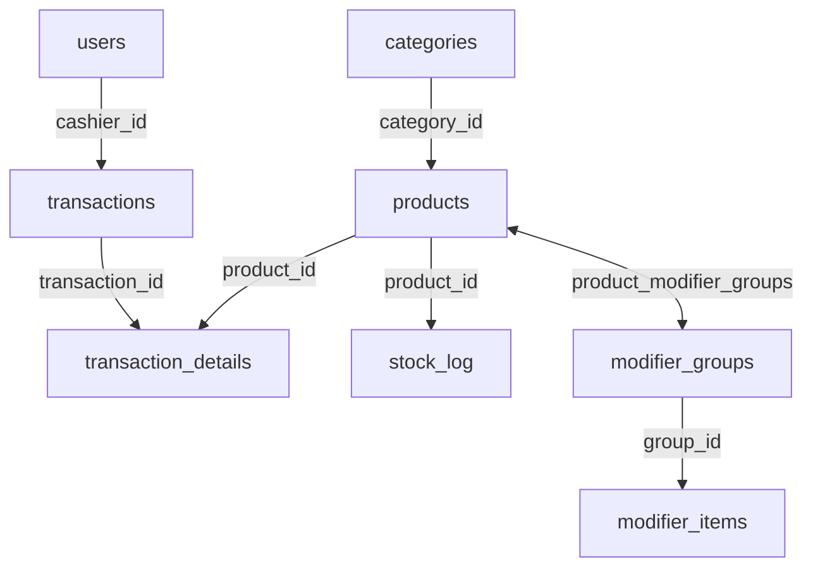

# POS_RESTO → Supabase Migration Walkthrough

## Deliverables

### 1. ERD & Documentation

File: [implementation_plan.md](file:///home/subkh4n/.gemini/antigravity/brain/15785b18-6c8f-4aab-a257-70461ea71c96/implementation_plan.md)

- Entity Relationship Diagram (Mermaid)
- Penjelasan relasi antar tabel
- Struktur detail setiap tabel

### 2. SQL Migration Script

File: [supabase_migration.sql](file:///home/subkh4n/Untitled%20Folder/POS_RESTO/supabase_migration.sql)

**Isi script:**

- 9 tabel database lengkap
- Foreign key relationships
- Performance indexes
- Row Level Security (RLS) policies
- Auto-update stock trigger
- Default users & categories

---

## Cara Penggunaan

### Step 1: Buka Supabase

Buka project → **SQL Editor**

### Step 2: Jalankan Script

Copy isi `supabase_migration.sql` → Paste → Run

### Step 3: Verifikasi

Cek **Table Editor** untuk memastikan semua tabel dibuat

---

## Struktur Database

> [!IMPORTANT]
> Ganti password default `admin123` dan `kasir123` sebelum production!
